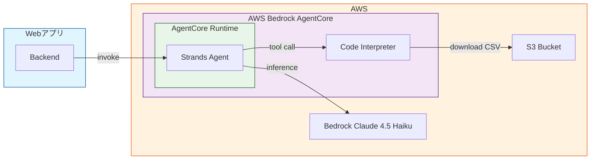
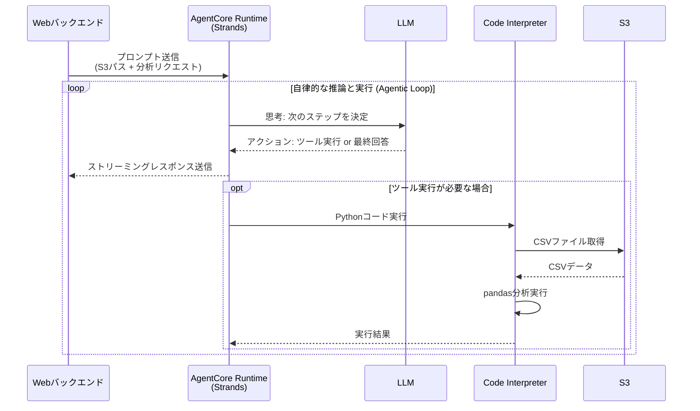

# Data Analyst Agent

AWS Bedrock AgentCore と Strands Agents を使用したデータ分析エージェント。
S3 上の CSV ファイルを自然言語で分析できます。

## アーキテクチャ

### 全体構成



### 処理フロー



## 前提条件

- Python >= 3.14
- [uv](https://docs.astral.sh/uv/)（パッケージマネージャ）
- AWS CLI（認証設定済み）
- bedrock-agentcore-starter-toolkit

## 環境セットアップ

### 1. 依存関係のインストール:

```bash
uv sync
```

### 2. AWS インフラのデプロイ（CDK）

本 AI エージェントは、ツールとして、AWS Bedrock の Code Interpreter を使用します。
したがって、ローカル実行であっても、CDK を使って、AWS 環境をデプロイする必要があります。

```bash
uv run cdk bootstrap
uv run cdk deploy --all --require-approval never
```

これにより以下がデプロイされます:

- S3 バケット（データ保存用）
- Code Interpreter（Python コード実行環境）
  - 現在、SANDBOX 環境ではなぜか S3 へのアクセスができないため、ネットワークモードを PUBLIC にしている。
- AgentCore Runtime 用 IAM ロール（agentcore deploy で使用）

### 3. agentcore CLI の設定

```bash
export RUNTIME_ROLE_ARN=$(aws cloudformation describe-stacks \
  --stack-name DataAnalystRuntimeRoleStack \
  --query "Stacks[0].Outputs[?OutputKey=='AgentCoreRuntimeRoleArn'].OutputValue" \
  --output text --region ap-northeast-1)

agentcore configure -e src/main.py -er $RUNTIME_ROLE_ARN -r ap-northeast-1
```

設定値は、各自好きなように設定してください。サンプルを以下に示します。

- Agent name: 任意
- Path or Press Enter to use detected dependency file: pyproject.toml
- Deployment Configuration: Direct Code Deploy
- Select Python runtime version: PYTHON_3_13
- Execution Role: (empty)
- S3 Bucket: (empty)
- Authorization Configuration: (empty)
- Configure request header allowlist?: (empty)
- MemoryManager: (empty)
- Optional: Long-term memory: (empty)

## ローカルで動作確認

### 1. ローカルでエージェントを起動

```bash
export CODE_INTERPRETER_ID=$(aws cloudformation describe-stacks \
  --stack-name DataAnalystCodeInterpreterStack \
  --query "Stacks[0].Outputs[?OutputKey=='CodeInterpreterId'].OutputValue" \
  --output text --region ap-northeast-1)

agentcore dev --env CODE_INTERPRETER_ID=$CODE_INTERPRETER_ID
```

### 2. 動作確認

```bash
agentcore invoke --dev '{"prompt": "1+1は？"}'
```

なお、ペイロードは以下のフォーマットで渡す必要があります。
s3 キーは任意です。

```json
{
  "prompt": "1+1は？"
  "s3": "s3://..."
}
```

## AWS へのデプロイ&動作確認

### 1. AgentCore Runtime へのデプロイ

```bash
export CODE_INTERPRETER_ID=$(aws cloudformation describe-stacks \
  --stack-name DataAnalystCodeInterpreterStack \
  --query "Stacks[0].Outputs[?OutputKey=='CodeInterpreterId'].OutputValue" \
  --output text --region ap-northeast-1)

agentcore deploy --env CODE_INTERPRETER_ID=$CODE_INTERPRETER_ID
```

### 2. 動作確認

```bash
agentcore invoke '{"prompt": "1+1は？"}'
```

## プロジェクト構成

```
.
├── src/
│   ├── main.py                 # エージェント実装
│   └── system_prompt.md        # システムプロンプト
├── infra/                      # AWS CDK インフラ
│   ├── app.py
│   └── stacks/
│       ├── agentcore_runtime_role_stack.py
│       ├── code_interpreter_stack.py
│       └── storage_stack.py
├── .bedrock_agentcore.yaml     # agentcore 設定
├── cdk.json
└── pyproject.toml
```

本リポジトリは、ゼロから作るテンプレート的位置づけであるため、 `.bedrock_agentcore.yaml` は git 管理から除外されています。
